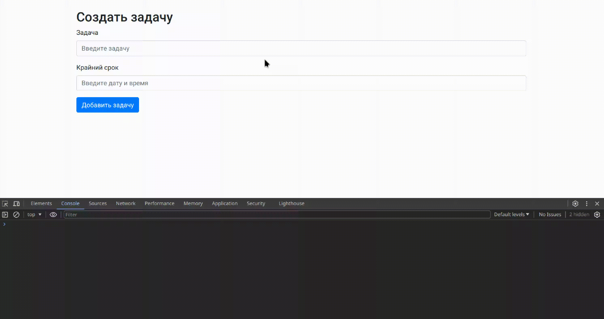

## Правила и регламент

- [Экзамен: правила, рекомендации и порядок проведения](https://hexly.notion.site/d9289c18871c44508bc7c7f05a51d94f)

## Задание

Ваша задача — написать логику для валидации предоставленной формы и отправки данных на сервер. Шаги могут быть выполнены в любом порядке, кроме первого шага, который обязательно должен быть выполнен первым.



## Запуск и сборка приложения

Для запуска приложения используйте команду:

```bash
make run
```

## Задача 1

В файле `src/index.js` напишите и экспортируйте по умолчанию функцию, которая добавляет форму добавления задачи в `index.html`.

### Условие

- Форма должна быть добавлена как дочерний элемент по отношению к элементу с классом `container`.
- Форма должна находиться под элементом *h2*.

### Форма

```html
<form>
    <div class="mb-3">
        <label for="task" class="form-label">Задача</label>
        <input autocomplete="off" type="text" name="task" class="form-control" id="task" placeholder="Введите задачу">
    </div>
    <div class="mb-3">
        <label for="deadline" class="form-label">Крайний срок</label>
        <input autocomplete="off" type="text" name="deadline" class="form-control" id="deadline" placeholder="Введите дату и время">
    </div>
    <button type="submit" class="btn btn-primary" id="submit-btn">Добавить задачу</button>
</form>
```

## Задача 2

Добавьте в функцию логику, которая отправляет запрос на сервер с помощью библиотеки **axios** и показывает модальное окно.

### Условия

- При сабмите должен совершаться POST запрос с данными формы по адресу `/tasks`.
- Сервер ответит только при условии, что:
    - Задача = любой текст начинающийся с заглавной буквы.
    - Дата и время = строка формата `ДД.ММ.ГГГГ ЧЧ:ММ`, например, `25.12.2024 14:30`.
- В случае успешного ответа:
    - Отображаем модальное окно с сообщением "Задача успешно добавлена!".
    - Модальное окно должно закрываться автоматически через 3 секунды.

### Метод реализации

- Обратите внимание на **index.html**, в нем уже находится модальное окно и **modal-backdrop**.
- Задача состоит в том, чтобы манипулировать классами модального окна и **modal-backdrop**.
- Показать модальное окно можно с помощью добавления класса `show` на элемент:
  `<div class="modal fade" id="successModal" tabindex="-1" role="dialog" aria-labelledby="exampleModalLabel" aria-hidden="true" style="display: none;">`
- Также можно менять `style="display: none;"` на `style="display: block;"`.
- То же самое надо проделать с **modal-backdrop**.

## Задача 3

Добавьте в функцию логику, которая добавляет визуальные эффекты инпутам в зависимости от валидации.

### Условия

- Напишите логику валидации для полей `task` и `deadline` в соответствии с условиями задачи.
    - Валидная задача = любой текст начинающийся с заглавной буквы.
    - Валидная дата и время = строка формата `ДД.ММ.ГГГГ ЧЧ:ММ`, например, `25.12.2024 14:30`.
    - Если инпут валидный, то добавляем ему класс: `input-valid`, иначе `input-invalid`.

Стили заранее прописаны в `style.css`.

## Задача 4

Добавьте в функцию логику, которая создает визуальный эффект для кнопки в зависимости от валидности полей формы.

### Визуальный эффект

- Если все поля формы валидны, кнопка должна "прыгать".
- Если хотя бы одно из полей формы невалидно, кнопка должна быть в обычном состоянии без анимации.
- Если все инпуты валидны, то добавляем кнопке класс: `bounce-animation`, иначе класса не должно быть.

Стили заранее прописаны в `style.css`.
# Zzzzz
